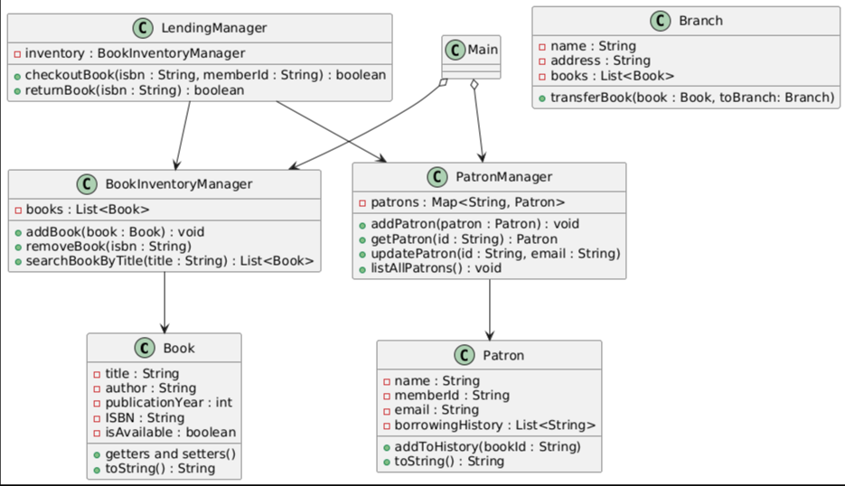

## Library Management System

### **Overview**
Welcome to the Library Management System (LMS) project! This application is a simple library management tool designed using **Java**, leveraging key **Object-Oriented Programming (OOP)** concepts such as encapsulation, inheritance, abstraction, and polymorphism. The application follows the **SOLID** design principles and employs clean architecture for maintainability.

This version of the LMS focuses on the core components:
1. **Books** and the `BookInventoryManager` for managing the library's book inventory.
2. **Patrons** and the `PatronManager` for managing library members.
3. **LendingManager** for handling book borrowing and returning processes.
4. `Main` class for demonstrating the system features.

---

### **Directory Structure**
```
src/java
├── books/
│   ├── Book.java
│   ├── BookInventoryManager.java
├── lending/
│   ├── LendingManager.java
├── patrons/
│   ├── Patron.java
│   ├── PatronManager.java
├── main/
│   ├── Main.java
README.md
class-diagram.png
```

---

### **Features**

#### 1. **Book Management (Books & BookInventoryManager)**
- **Book Class**:
    - Represents a **book** as part of the library inventory.
    - Attributes include:
        - `title`: Title of the book.
        - `author`: Author of the book.
        - `ISBN`: A unique identifier for each book.
        - `publicationYear`: Year of publication.
        - `isAvailable`: A flag to track the book's availability status.
    - Methods:
        - Getters and setters for all attributes.
        - `toString()`: To display book information in a user-friendly format.

- **BookInventoryManager Class**:
    - Manages library inventory of books.
    - Key features:
        - Add books to the inventory.
        - Remove books from the inventory using ISBN.
        - Search for books by various parameters (title, author, or ISBN).
        - List all the books in the library.

#### 2. **Patron Management (Patron & PatronManager)**
- **Patron Class**:
    - Represents individual library members.
    - Attributes include:
        - `name`: Patron's name.
        - `memberId`: A unique identifier for each member.
        - `email`: Contact email for the member.
        - `borrowingHistory`: List of book ISBNs previously borrowed by the patron.
    - Methods:
        - Add an ISBN to the borrowing history.
        - Getters and setters.
        - `toString()` for user-friendly display of patron details.

- **PatronManager Class**:
    - Manages library members (patrons).
    - Key features:
        - Add patrons to the system.
        - Update patron information (e.g., email).
        - Retrieve patron details using their member ID.
        - List all registered patrons.

#### 3. **Lending Process (LendingManager)**
- **LendingManager Class**:
    - Manages the borrowing and returning of books.
    - Key features:
        - **Borrow Books**: Checks if a book is available and updates its availability status. Also updates the borrowing history of the patron.
        - **Return Books**: Marks a borrowed book as available again and validates the return process.

#### 4. **Main Entry Point (`Main` Class)**
- Demonstrates features of the LMS in the main program.
    - Adds books to the inventory.
    - Registers patrons in the system.
    - Allows borrowing and returning books.
    - Displays the list of books and patrons.

---

### **Design Principles**

#### 1. **Object-Oriented Programming Concepts**
- **Encapsulation**:
    - All attributes are private, and getters and setters are provided for controlled access.
- **Abstraction**:
    - High-level functionality like managing books or lending is abstracted into modular classes.
- **Polymorphism**:
    - Future extensions (e.g., adding different types of books or patrons) can be implemented easily.
- **Inheritance** can be introduced later for hierarchy-related functionality.

#### 2. **SOLID Design Principles**
- **Single Responsibility Principle**:
    - Each class has a single responsibility, e.g., `Book` for book-related attributes, `BookInventoryManager` for managing books in the inventory.
- **Open/Closed Principle**:
    - The system is designed to allow extension without modifying existing code (e.g., adding new features like multi-branch support).
- **Dependency Inversion Principle**:
    - Centralized managers (`LendingManager`, `PatronManager`, and `BookInventoryManager`) are decoupled to promote flexible interactions.

#### 3. **Design Patterns**
- **Singleton Design Pattern** (Optional):
    - `BookInventoryManager` and `PatronManager` can be implemented as Singleton classes to ensure centralized management with a single instance running throughout the application lifecycle.

---

### **Class Interactions**
The key interactions between the classes are as follows:
1. The `Main` class instantiates all the required manager classes (`BookInventoryManager`, `PatronManager`, and `LendingManager`).
2. The librarian interacts with:
    - `BookInventoryManager` to add, remove, or search for books.
    - `PatronManager` to register or update patron details.
    - `LendingManager` to manage borrowing and returning of books.
3. `LendingManager` relies on both `BookInventoryManager` and `PatronManager`:
    - It uses `BookInventoryManager` to check availability and update the book's status.
    - It uses `PatronManager` to track borrowing history.

---

### **How to Run the Application**

1. Clone the repository:
    ```bash
    git clone https://github.com/Avvinashjha/LMS.git
    cd LMS
    ```
2. Observe the demo:
    - Watch examples of books being added, patrons being registered, and books being borrowed/returned in the console output.

### **TODO: How to Extend the System**
1. **Add Multi-Branch Support**:
    - Add a `Branch` class and `BranchManager` for book transfers between branches.
2. **Add Reservations**:
    - Add `ReservationManager` with an **Observer Pattern** for notifying patrons.
3. **Add Recommendations**:
    - Implement collaborative filtering based on similarity in borrowing histories.

---

### **Class Diagram**

For a detailed UML diagram showing class relationships



---

### **Author**
- [Avinash Jha](https://github.com/Avvinashjha)

Feel free to contact me with questions, feedback.
